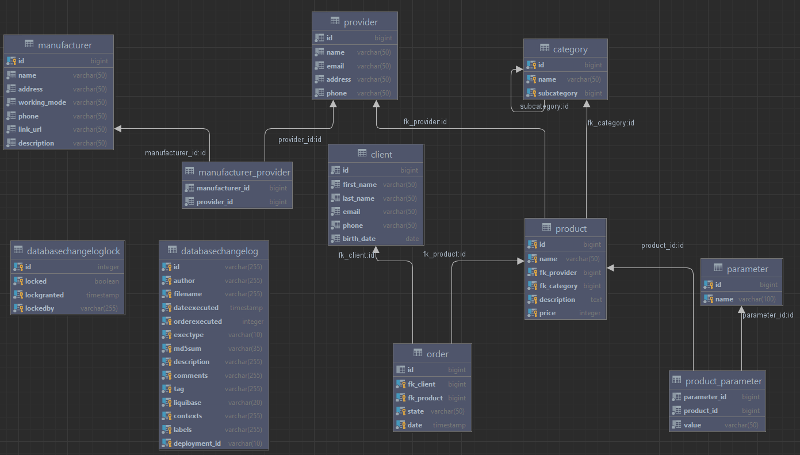
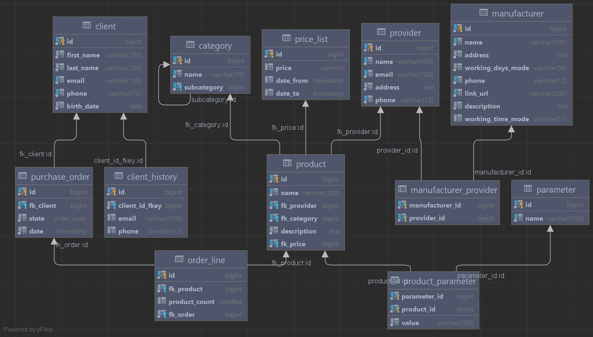

# База данных "Интернет-магазин"
Позволяет осуществлять взаимодействие между продавцами и покупателями

# Проектирование БД
## Схема


## Документация

Все таблицы и столбцы таблиц имеют комментарии с помощью конструкции 
```postgresql
COMMENT ON TABLE table_name IS 'comment'
COMMENT ON COLUMN table_name.column_name IS 'comment'
```

## Бизнес задачи
Чтобы добавить товар на страницу магазина необходимо:
1) Создать производителя и поставщика через таблицы manufacturer и provider соответственно
2) И связать эти таблицы через manufacturer_provider
3) Добавить названия харакетеристик в таблицу parameters
4) Добавить категорию товара в таблицу category
5) Создать товар в таблице product
6) Добавить значения характеристик товара по ключу через product_parameter

# Добавление индексов и ограничений
В changelog.sql в changeset "snegov-ds:2" были добавлены индексы, для наиболее частых будущих запросов к БД.
Каждый индекс так же имеет описание через команду 
```postgresql
COMMENT ON INDEX index_name IS 'comment'
```

Были добавлены следующие ограничения:

1)Ограничение на запрет пустых значений (NOT NULL)
```postgresql
ALTER TABLE table_name ALTER COLUMN column_name SET NOT NULL;
```

2)Ограничение на уникальность значения UNIQUE
```postgresql
ALTER TABLE table_name
    ADD CONSTRAINT constraint_name UNIQUE (column_name);
```

3)Ограничение по условию (CHECK)
```postgresql
ALTER TABLE table_name
    ADD CONSTRAINT constraint_check_name CHECK (condition = true);
```

# Проектирование БД V2
## Схема


## Изменения
Все изменения находятся в changeset snegov-ds:3
- Были оптимизированы типы данных
- Изменено название таблицы "order" на "purchase_order" из-за того, что order является ключевым словом в SQL
- Добавлены таблицы:
  1) client_history (для логирования старых данных клиента. туда данные добавляются через триггер)
  2) price_list (отображение цен на конкретный период времени для конкретного товара)
  3) order_line (возможность добавлять в заказ сразу несколько товаров с разным количеством)
- Для поля purchase_order.state создан enum со списком статусов у заказа 
