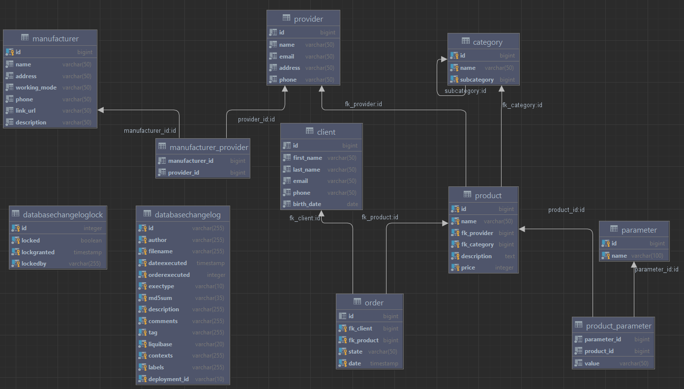

# Проектирование БД
## Схема


## Документация

Все таблицы и столбцы таблиц имеют комментарии с помощью конструкции
```postgresql
COMMENT ON TABLE table_name IS 'comment'
COMMENT ON COLUMN table_name.column_name IS 'comment'
```

## Бизнес задачи
Чтобы добавить товар на страницу магазина необходимо:
1) Создать производителя и поставщика через таблицы manufacturer и provider соответственно
2) И связать эти таблицы через manufacturer_provider
3) Добавить названия харакетеристик в таблицу parameters
4) Добавить категорию товара в таблицу category
5) Создать товар в таблице product
6) Добавить значения характеристик товара по ключу через product_parameter
