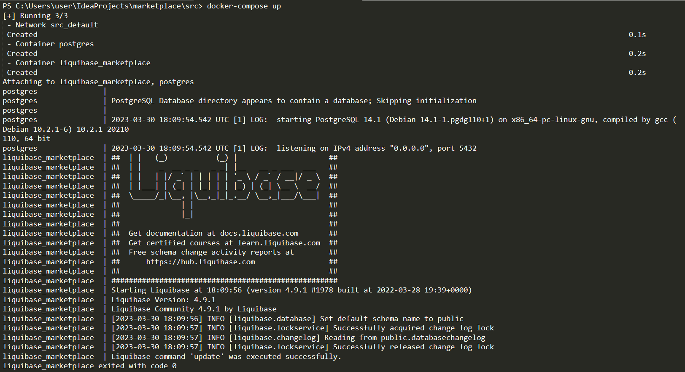
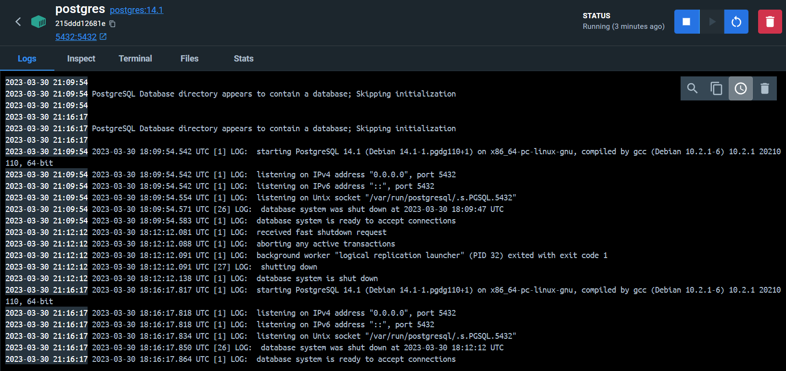
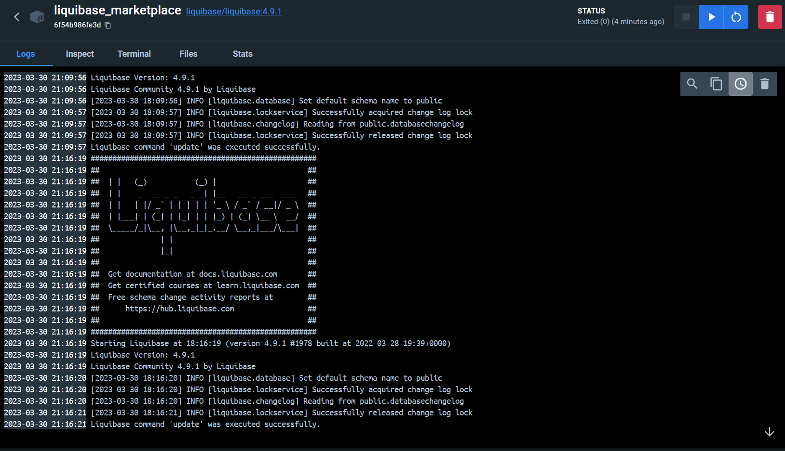

[На главную](../../README.MD)

# Установка СУБД PostgreSQL
Добавлен файл docker-compose.yml, с помощью которого мы запускаем контейнер с бд Postgres и системой контроля версий Liquibase.
После успешного запуска Postgres запускается контейнер с Liquibase, который будет загружать в пустую бд наши таблицы

Запуск docker-compose.yml файла вызывается командой:
```
docker-compose up
```
## Пример выполнения команды

Так же в этом yaml файле все значения настроек вынесены в .env файл
То есть ${POSTGRES_USER} будет заменен на значение из .env файла

## Логи контейнера Postgres


## Логи контейнера Liquibase
